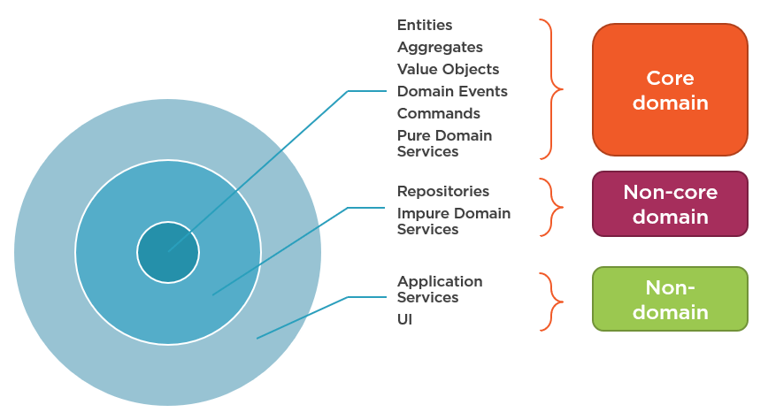

# Commands and Queries

Using command and queries it's a way to decouple your architecture , using hexagonal architecture , also sometimes referred as ports and adapters, or [onion-layers](https://www.codeguru.com/csharp/understanding-onion-architecture/)

Specifically commands and queries and a way to communicate using DTO's (Data transfer Objects) **between the infrastructure layer and the application layer**.



If we consider a structure like this, where the external it's everything related with the exterior connections (api, frameworks, cli-commands, database),
and we consider the inner part as pure logic, then the middle layer its the application layer.
These DTO's are intended to transfer information from the external to the middle part.

[A DTO's its a simple POPO (Plain Old Php Object) that transfer with it some values.](https://dev.to/fuadardiono/plain-old-php-object-usability-and-benefits-in-modern-php-programming-32oc)
For example:

```php
class UserDTO {
    private int $id;
    private string $name;
    private string $email;

    private function __construct(int $id, string $name, string $email) {
        $this->id = $id;
        $this->name = $name;
        $this->email = $email;
    }

    public static function create(int $id, string $name, string $email): UserDTO {
        return new self($id, $name, $email);
    }

    public function id(): int {
        return $this->id;
    }

    public function name(): string {
        return $this->name;
    }

    public function email(): string {
        return $this->email;
    }
}

```

Or if we use php 8 [constructor property promotion](https://stitcher.io/blog/constructor-promotion-in-php-8) :

```php
final readonly class UserDTO {
    public function __construct(
        public readonly int $id,
        public readonly string $name,
        public readonly string $email) {
    }
}

```

So in essence queries and commands are simple messages with a meaning.

## Commands

Commands are intended to communicate a change in the state of the system. If this system is connected to a storage, we can think of a change in the storage.
For example, if we want to create / update / delete a new object.
If we see it from the perspective of REST verbs, commands should be used for: **POST, PUT, PATCH, DELETE**
So they imply a change, a write in the storage a change of state, the also imply to execute an action.
Commands also should always generate a [domain event](domain-events.md)

## Queries

Queries are intended to ask a question about the state, for example how many of this object with this condition are in the system.
The operations that queries does are intended to be readonly, and should never imply a change of the state.
If we see it also from the REST verbs perspective, queries can be associated with : **GET**

## Why not use plain DTO's

The main object about commands and queries , it's to separate read and writes from a system. That implies a lot of possible
optimizations, for example queries can go to simple views in a database or to a readonly cache system, meanwhile commands should go to a real storage to do some changes.
Decoupling this two operations allow later to do some huge optimizations, for example couple the queries to a superfast database for reads like elasticsearch or a memory system like redis.
Meanwhile, we normally want to have a more [ACID](https://www.mongodb.com/basics/acid-transactions)system to the writes.
Separating command and queries is the first step forward going to a [CQRS](https://www.techtarget.com/searchapparchitecture/definition/CQRS-command-query-responsibility-segregation).
[more info](https://ducmanhphan.github.io/2020-12-02-command-bus-pattern/)


Also, normally commands implies a execute and forget system, for example look at this controller:

```php

#[AsController]
final readonly class AddPetController
{
    public function __construct(
        private CommandBus $commandBus
    ) {}

    public function __invoke(
        #[MapRequestPayload]
        Pet $pet,
    ): JsonResponse {
        $this->commandBus->handle(new AddPetCommand($pet));

        return new JsonResponse(null, Response::HTTP_CREATED);
    }
}
```

As you can see, we just create a new Command, and we just send the command to the commandBus, we don't receive any response from it.
The only response from a command should be exceptional, meaning an exception, something happened to the system that didn't allow me to do the changes.

Meanwhile a query controller:

```php
#[AsController]
final readonly class GetPetByIdController
{
    public function __construct(
        private QueryBus $queryBus
    ) {}

    /**
     * @param null|int $petId
     */
    public function __invoke(
        int $petId,
    ): JsonResponse {
        $response = $this->queryBus->query(new GetPetByIdQuery($petId));

        return new JsonResponse($response, Response::HTTP_OK);
    }
}
```

Will capture a response, that will be served afterward, since the intention is to ask a question and get a response.

In order to simplify the operations we have created inside the system a command and query buses, very simple and manual,
but with 100% coverage in unit tests.

## Command BUS

In object-oriented design, the chain-of-responsibility pattern is a design pattern consisting of a source of command objects and a series of processing objects. Each processing object contains logic that defines the types of command objects that it can handle; the rest are passed to the next processing object in the chain.

In essence a command bus is just a chain-of-responsibility pattern.
In our case we have developed several middlewares to deal with the commands, they are on: src/Infrastructure/Bus/CommandMiddleWares


Middlewares:

1. CommandHanlderSelector: Pass the command remember a [DTO's](https://github.com/api-platform/docs/discussions/1535) to the command handler that needs to receive it
2. DatabaseTransaction: Create a transaction inside the database, since we are going to write, if there is an exception the action will be rolled back, if everything goes ok, the operation will be executed
3. LogCommand: Will just log the command

If we need to create a new middleware, its just needs to implement the CommandMidleware interface, and remember to finish it with $nextMiddleware($command);

## QueryBus

The query bus is a lot more simple, just search for the correct handle, logs the query, and normalize to array prepared for json the response of the handler.
Meaning, your doctrine queries can return objects or arrays, the normalizer will transform it, and after the query bus will be a simple array.

## Handlers

Each command and each query, should have a handler.
The handler its were we put the logic of our application layer, its our use-case, where we communicate with the domain, we do the logic on the domain,
and then we communicate with the infra layer to persist our business.

## Overview

Using this pattern allow us to decouple from the "framework" or infra layer.
Allow us for the application layer to just receive a "DTO" with some extra meanings.
Also allow us to start programming besides if the command or query comes from a cli-command , from a controller, or from another kind of interaction that arrives from the infrastructure layer,
we just need to start programming in the application layer, leaving the infra as an implementation detail.
