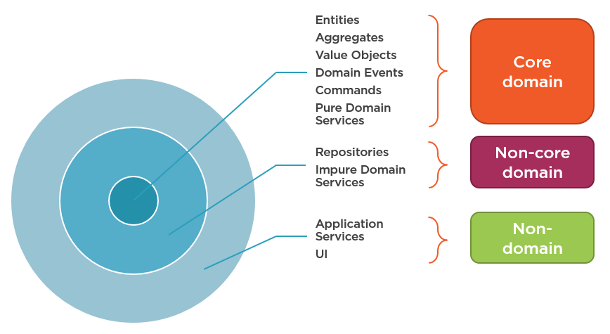
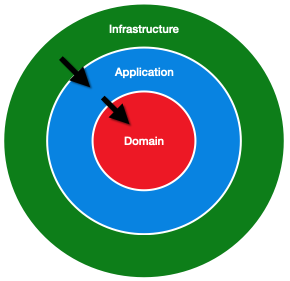

# Hexagonal Architecture

Hexagonal architecture its a software architecture that belongs to the so-called "clean architectures", cause
they are suppose to help produce code that is maintainable, scalable and testable.

Encouraging this case of architectures facilitates the development of the software in a more "clean" way.

## What is exactly hexagonal architecture?

First of all, there are a million of articles in internet about it, but lets start with clearing a misunderstanding.
When we search for [hexagonal architecture](https://www.happycoders.eu/software-craftsmanship/hexagonal-architecture/)  we can find very dense and literate articles about this architecture, and tend to reflect
this architecture as an hexagon:


So, first of all, this architecture is not an hexagon, the hexagon or hexagonal comes from a traditional way of representing some of the parts, called ports in the vertices of the hexagon.
In reality , the concept can be simplified as a simple 3 layers architecture, also called **onion architecture**

## Onion Architecture

This hexagonal architecture, can also be called [onion architecture](https://www.codeguru.com/csharp/understanding-onion-architecture/) (other names are port and adapters architecture)



So basically we can talk about 3 concentric layer, from the external to the inner part:

- Infrastructure
- Application
- Domain

[More info](https://developer20.com/services-in-ddd-finally-explained/)

Its important the order of these layers, because they also mean we are going to the external world to the internal world.

## Infrastructure Layer

It's the contact with the external world and the other software not related with our logic.
For example:

- Cli / console commands
- Database
- Controllers
- UI / Resources
- Framework connections
- Doctrine repositories
Everything that is not our logic, but our software needs to work, the external dependencies.
This layer is not so easy to export to another project/framework since its attached to the framework

## Application Layer

It's the **bridge** between the infrastructure (external) and our domain(pure logic)
Normally it contains the [Commands and queries](commands-and-queries.md) , meaning the DTO's to **use** [our use cases , and our use cases](#use-cases).
In this layer it's where we will start programming, since all the infrastructure layer should be automated in this repo with the ddd-extractor
ALso in this layer we can have impure services. (with side effects)
This layer can be exported without many effort to another project / framework

## Domain Layer

All the logic, the pure logic, what make the business earn money, the core domain.
Inside this layer we need to have:

- Entities / aggregates / value objects
- [Domain Events](domain-events.md)
- Pure domain Services
- Domain repositories (interfaces!)
This layer can be exported with zero effort to another project / framework

## Dependencies between layer



1. Infrastructure
    WIll have dependencies from the framework and the connectivity to other systems
2. Application
    Will receive objects from the infrastructure, and will communicate with objects in the domain
3. Domain
    Will not have external dependencies.

So if we write as a rule:
Classes in namespace App\Domain should not depend on classes in namespace App\Application and classes in namespace App\Infrastructure
Classes in namespace App\Application should not depend on classes in namespace App\Infrastructure

## Communication between layers

The infrastructure should only communicate with application.
The way we communicate infrastructure with application is by sending [commands and queries](commands-and-queries.md).
Application can communicate with domain and with infrastructure, since its in the middle.
Domain can launch domain events to communicate the changes of states.

## Use-Cases

The use cases are the orchestrators of our domain logic, for example a use case can be described as : "A comment can be added to a blogpost"

Then the use case should:

1. Receive a CommentDTO $commentDTO, an blogpostId $blogId.
2. Should create a domain Object of type Comment (the validation should be on the domain), so we can call something like, Comment::createFromRequestDTO($commentDTO): Comment
3. Should receive from the blogpostRepository an object of type BlogPost (domain one)-> $blog
4. And finally do the logic $blog->addComment($comment)

5. So our command handler could have this shape:

```php
public function handle(CommandInterface $command): void
    {
        // **step 1: Receive data from the command
        $blogId = $command->blogId;
        $commentRequest = $command->commentDTO;
        // **step 2: create the comment
        $comment = Comment::createFromRequest($commentRequest);
        // the creation of the object, and the validation rules must be expressed in the domain
        // since this step create a domainObject should also create a DomainEvent!!
        // **step 3: get the blogpost
        $blog = $this->blogpostRepository->find($blogId);
        // **step4: add the comment to the blogpost
        $blog->addComment($comment);
        // this last step also should launch a domainEvent!!
    }
```
