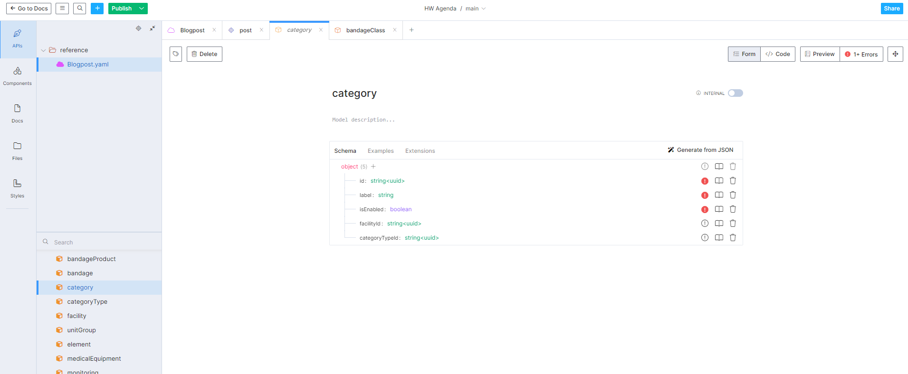
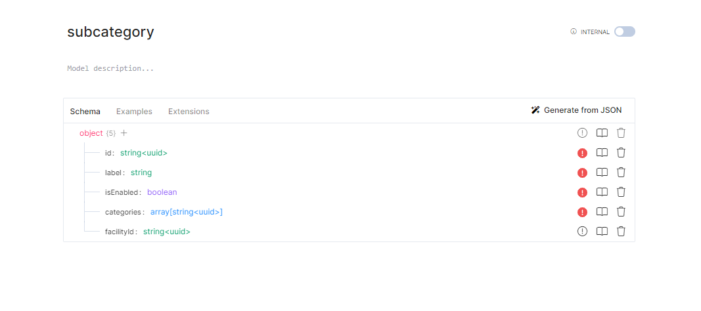
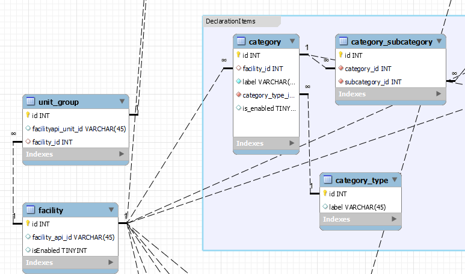
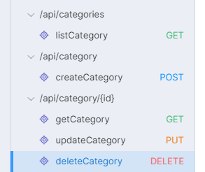

# HOW TO DEFINE THE OPEN API

Some general advices, we recommend to use [stoplight.io](https://stoplight.io/solutions)

This tool allows you to define OpenApi in a very easy to use GUI, its online as a saas, but also has some downloadable versions.
In both cases, you need to create an account, we recommend to use a personal email. (if several people registers with Evolucare accounts,
they will reach us, and our use is minimal, and can be on the free tier, if It's for personal purposes)
Once register, you can create up to 3 spaces, but It's important to note, that you can always use the same, copying and pasting the resulting yaml / json

*Our generator works with some small standards over the standards used on openApi, to generate fully functional models, please follow these indications.*

## Route prefix

We use this syntax at the beginning of the contract in order to have all the routes under this prefix.

```yml
...
servers:
  - url: 'http://localhost:3000/api/{PREFIX}'
...
```

## Models

How to define relations and fields:

1. Always try to **enrich the types**, if its string could be uuid, datetime, etc..
2. If there is a *one-to-many* relation in the model, use the ending (entityId) and type `string<uuid>`.
For *one to many or many to one*, define always on the many side of the relation, or better,
*define in the model where this relation will be consider a One*.
Meaning, for example between category and categoryType, there is a one to many (one categoryType will be in many categories).
But we can have done the reverse way, categoryType has many categories. Please don't, use always the one!!

I.E: facilityId: `string<uuid>`, categoryTypeId: `string<uuid>`
3. If we want a many-to-many relation we define a plural (of the entity), and we use array of `string<uuid>`,
it means there is a many to many between these 2 entities, for example in this case category and subcategory,
but imagine blogposts and authors:

Always define in just one of the models! (you can notice category model don't have an array of Subcategories, there is no need, our generator will find the many to many and fill the gap)

This example will be represented in an entity model relation like this:


## Endpoints

If we want to create a CRUD, Create Retrieve Update Delete for an entity for example categories,
we need 5 endpoints:

| Description | Method | Naming   | Example Path   | request body | Response                  |
|-------------|--------|----------|----------------|--------------|---------------------------|
| List        | GET    | Plural   | /categories    | no           | 200 - array of categories |
| Create      | POST   | Singular | /category      | yes          | 201                       |
| Retrieve    | GET    | Singular | /category/{id} | no           | 200 - category object     |
| Update      | PUT    | Singular | /category/{id} | yes          | 202                       |
| Delete      | DELETE | Singular | /category/{id} | no           | 205                       |

Methods that contain object in request body (Create, Update) may also return a 422 (entity not processable) response
Methods that have parameter (Retrieve, Update, Delete) in path can return 404 (not found) response



## Extra important considerations

In order for the generator to work, please:

1. Create tags per entity/model you want, and tag the endpoints with it
2. Fill the operationId of the endpoint with the words (Create, Update, Delete, List, Get)
3. Path parameters must be nested immediately within paths and not within individual methods.

## Example of a CRUD

```yaml
  /categories:
    get:
      summary: listCategory
      tags:
        - category
      responses:
        '200':
          description: OK
          content:
            application/json:
              schema:
                type: array
                items:
                  $ref: '#/components/schemas/category'
      operationId: listCategory
  /category:
    post:
      summary: createCategory
      operationId: createCategory
      responses:
        '201':
          description: Created
        '422':
          description: Unprocessable Entity (WebDAV)
      tags:
        - category
      requestBody:
        content:
          application/json:
            schema:
              $ref: '#/components/schemas/category'
    parameters: [ ]
  '/category/{id}':
    parameters:
      -   schema:
            type: string
          name: id
          in: path
          required: true
    get:
      summary: getCategory
      operationId: getCategory
      responses:
        '200':
          description: OK
          content:
            application/json:
              schema:
                $ref: '#/components/schemas/category'
        '404':
          description: Not Found
      tags:
        - category
    put:
      summary: updateCategory
      operationId: updateCategory
      responses:
        '202':
          description: Accepted
        '404':
          description: Not Found
        '422':
          description: Unprocessable Entity (WebDAV)
          content: { }
      tags:
        - category
      requestBody:
        content:
          application/json:
            schema:
              $ref: '#/components/schemas/category'
      description: ''
    delete:
      summary: deleteCategory
      operationId: deleteCategory
      responses:
        '205':
          description: Reset Content
        '404':
          description: Not Found
      tags:
        - category
```

The generator will fill all CRUD endpoints and will generate all tests (functional and unit for the CRUD to be 100% covered)

## Paginate and Extra filters

In order to create pagination for lists you should add two extra queryParameters:

- pageSize
- pageNumber

For example:

```yaml
    /myListWithPaginate:
        get:
            parameters:
                -  schema:
                       type: integer
                   name: pageSize
                   in: query
                   required: false
                -   schema:
                        type: integer
                    name: pageNumber
                    in: query
                    required: false
```

In this case all the code will include the option to add to your endpoint the call, in example:
GET /myListWithPaginate?pageSize=20&pageNumber=3
Will get the page number 3, with a size of 20 pages.

If you want to use special filters for your endpoints, for example, in a list, we want to also have the option to filter by several other fields:

```yaml
        get:
            parameters:
                -   schema:
                        type: string
                    name: patientId
                    in: query
                    required: false
                -  schema:
                       type: integer
                   name: pageSize
                   in: query
                   required: false
                -   schema:
                        type: integer
                    name: pageNumber
                    in: query
                    required: false
                -   schema:
                        type: string
                        format: uuid
                    name: bodyLocationId
                    in: query
                    required: false
```

Here we have the patientId, the paginate, and also another field called bodyLocationId.
Since bodyLocationId is also an uuid, the code will determine it's a relation, will do the joins to filter for this field.
For the field Patient since its not uuid, will add to the query a where condition.

In case you want to filter for a many to many:
```yaml
                - schema:
                      type: array
                      items:
                          type: string
                          format: uuid
                  in: query
                  name: tags[]
                  description: 'The array of ids of Tags, its a many to many relation'
```
The type must be array, and the name must be the plural with []( Its important, since for php to process as array should be [].)
Also the items should be type: string, and format:uuid.

Using this convention, the query will be translated to a: "WHERE tag.id IN (tag1,tag2, etc..)"

## Domain Events

If we want to automatically create domain events in certain paths operations, you can add it with
the extra "extension" parameter x-domain-event:

```
    blogpost:
        post:
            summary: createBlogpost
            tags:
                - blogpost
            responses:
                '201':
                    description: Created
                '404':
                    description: Not Found
                '422':
                    description: Unprocessable Entity (WebDAV)
            operationId: createBlogpost
            requestBody:
                content:
                    application/json:
                        schema:
                            $ref: '#/components/schemas/Blogpost'
            x-domain-event: ~
```

The domains events will be generated in commands only. If it's on update or create will be launched inside the domain entity,
but for delete will be generated in the command handler:
```php
DomainEventPublisher::instance()->publish(new DeletedTagEvent(
            get_class($tag),
            $tag->id,
            $tag->name,
            $tag->slug,
        ));
```
All this domain events are tested in the tests/application layer.

## :star: Working example
You have a working example in the folder contracts/blogpost.yml with a schema of the relations on BlogpostSchema.png